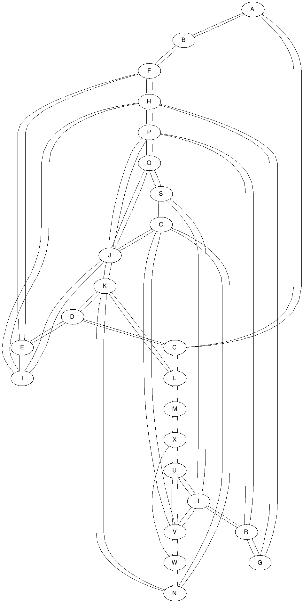

Script to run the simulation of drivers going from different points in the
ortuzar and siouxfalls networks

Neworks
=======

Ortuzar
-------


Sioux Falls
-----------



Dependencies
============
 * python 2.7
 * [pyevolve](https://sourceforge.net/projects/pyevolve/) (pip install pyevolve)

Usage
=====

```bash
python traffic_simulation.py [OPTIONS]
```

All the options have usable defaults so check them before running a experiment.

Use:

```bash
python traffic_simulation.py -h
```

To list all the options.

Checking the results
--------------------

After the execution is complete, a new file in the "results_gaql_grouped" folder
should be created.

The name of the file will contain the parameters used to run the experiment
and the local time when it happened.

Examples
--------

* Run an experiment with the *siouxfalls* network and prints the travel time
  for the each pair of Origin and Destination

```sh
python traffic_simulation.py --network "siouxfalls" --printPairOD
```

* Run an experiment with the *ortuzar* network printing the link costs at every
100 generations with the mutations of 0.003 and 0.03

```sh
python traffic_simulation.py --printLinkCosts --printInterval 100 --mutations 0.003 0.03
```

Options
=======

```
optional arguments:
  -h, --help            show this help message and exit
  -c, --printLinkCosts  Print link's costs at each iteration in the output
                        file
  -d, --printDriversPerLink
                        Print the number of drivers in at each iteration in
                        the output file
  -p, --printPairOD     Print the average travel time for in the header in the
                        output file
  -i PRINTINTERVAL, --printInterval PRINTINTERVAL
                        Interval by which the messages are written in the
                        output file
  --generations GENERATIONS
                        Maximum mumber of generations in each configuration
  --population POPULATION
                        Size of population for the genetic algorithm
  --group_sizes GROUP_SIZES [GROUP_SIZES ...]
                        List of group sizes for drivers in each configuration
  --alphas ALPHAS [ALPHAS ...]
                        List of learning in each configuration
  --decays DECAYS [DECAYS ...]
                        List of decays in each configuration
  --crossovers CROSSOVERS [CROSSOVERS ...]
                        List of rate of crossover in the population in each
                        configuration
  --mutations MUTATIONS [MUTATIONS ...]
                        List of rate of mutations in each configuration
  --ks KS [KS ...]      <TODO WRITE HELP MESSAGE FOR THIS OPTION>
  --intervals INTERVALS [INTERVALS ...]
                        <TODO WRITE HELP MESSAGE FOR THIS OPTION>
  --repetitions REPETITIONS
                        How many times it should be repeated
  --network {ortuzar,siouxfalls}
                        Which network should be used
  --experimentType {1,2,3,4}
                        How many repetition for each configuration. 1 - Use
                        Q-Learn Only 2 - Use Genetic Algorithm 3 - The Genetic
                        Algorithm receives information from the Q-learn
                        algorithm 4 - The Genetic Algorithm receives and
                        updates information from the Q-learn algorithm
  --elite_size ELITE_SIZE
                        How many elite individuals should be kept after each
                        generation
```
